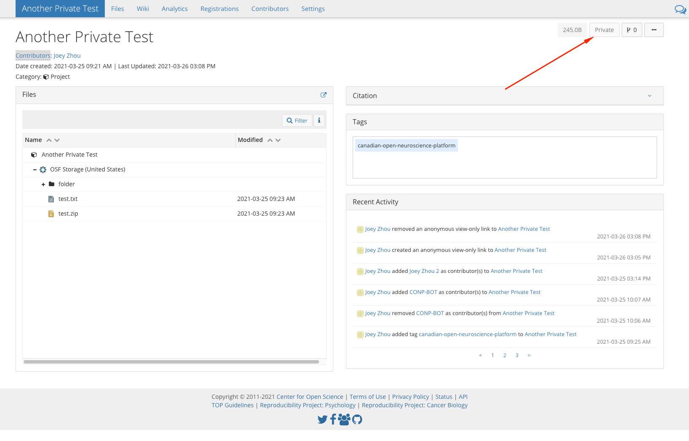
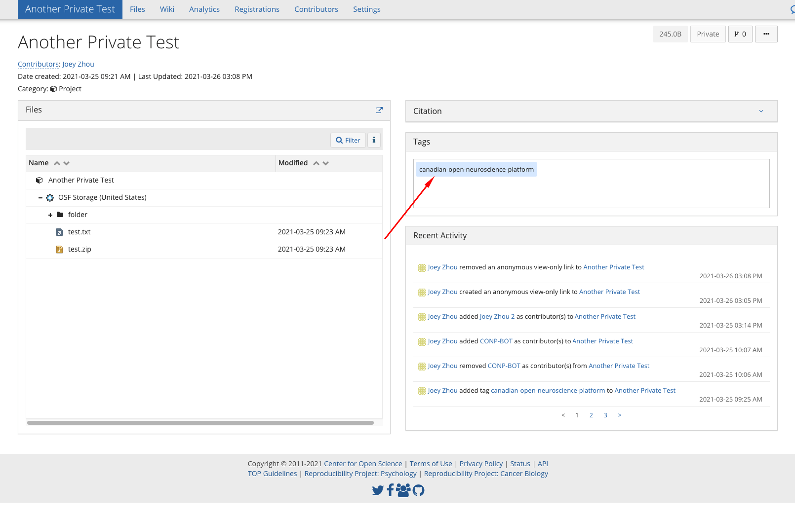
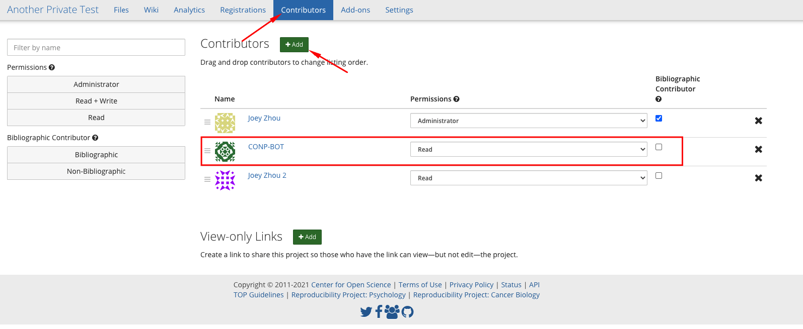
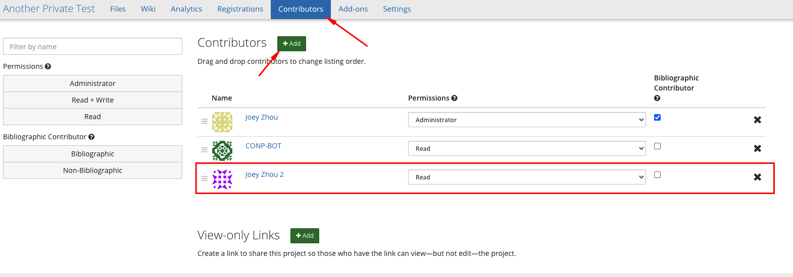
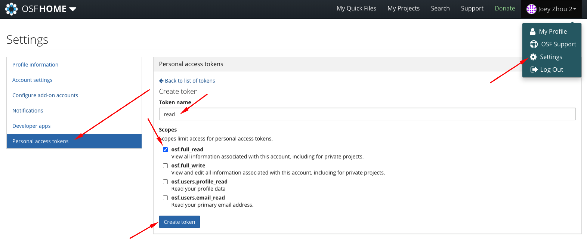
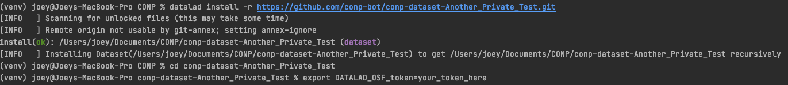
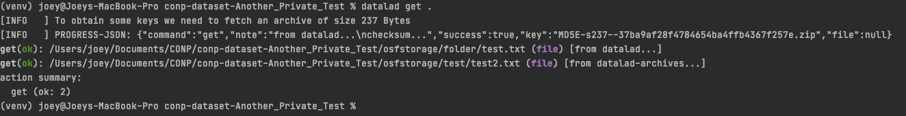

# OSF Private Dataset Guide

The OSF crawler fully supports crawling private datasets on OSF and this guide will show you how to get your private dataset crawled and added to CONP from OSF and how to retrieved crawled OSF private datasets using DataLad.

## How to get your private dataset crawled

1) Ensure that your dataset is indeed private by checking that the `Private` button in your OSF dataset is grey and can't be pressed

   
2) Add `canadian-open-neuroscience-platform` as a tag

   
3) In the `Contributors` tab above, grant the user `CONP-BOT` the `READ` permission and do not add it as a Bibliographic Contributor

   This will allow our crawler to access and add your dataset in CONP. The dataset won't be accessible from the general public and you will have to explicitly grant permissions for users in OSF to access your data. See below for more information
   

## How to access a private dataset that has been crawled from OSF

1) You will need to ask the owner of the dataset to grant you permission to access their dataset by creating an OSF account and asking the owner to add you as a contributor with `READ` permission

   
2) Get a personal access token from your settings -> Personal access tokens -> Create token -> give it any name and only osf.full_read access -> Create token. Save this token for the following steps

3) In a terminal, install locally the dataset you want to access using `datalad install -r <dataset github url>`, change directory into the dataset `cd your_dataset` and set the environment variable `DATALAD_OSF_token` to be the token you received in the previous step using `export DATALAD_OSF_token=<your_token>`

   
4) You should now be able to retrieve any file you wish in the dataset using `datalad get <file_name>` or `datalad get .` to get all the files

