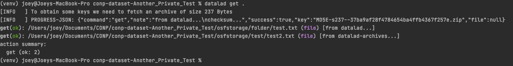

# How to access private datasets crawled from Zenodo

1) You will need to ask the owner of the dataset to grant you permission to access their dataset by creating a Zenodo account and requesting access to their dataset

   
2) Once the dataset owner grants you access, you will receive an email with your personal access token

3) In a terminal, install locally the dataset you want to access using `datalad install -r <dataset github url>`, change directory into the dataset `cd your_dataset` and set the environment variable `DATALAD_ZENODO_token` to be the token you received in the previous step using `export DATALAD_ZENODO_token=<your_token>`

   
4) You should now be able to retrieve any file you wish in the dataset using `datalad get <file_name>` or `datalad get .` to get all the files

