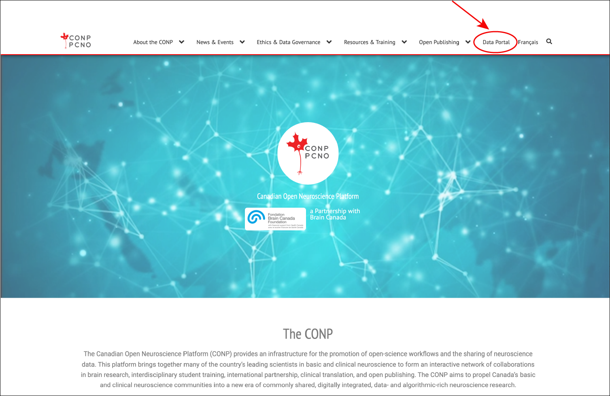
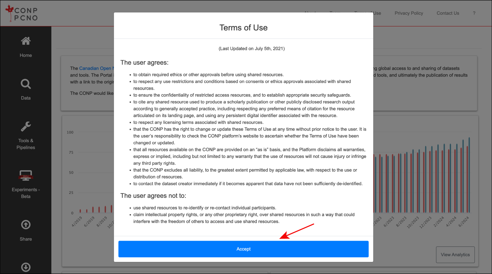
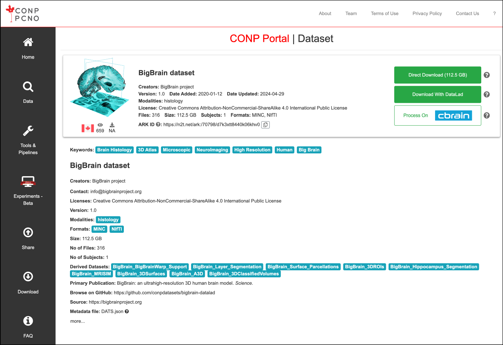
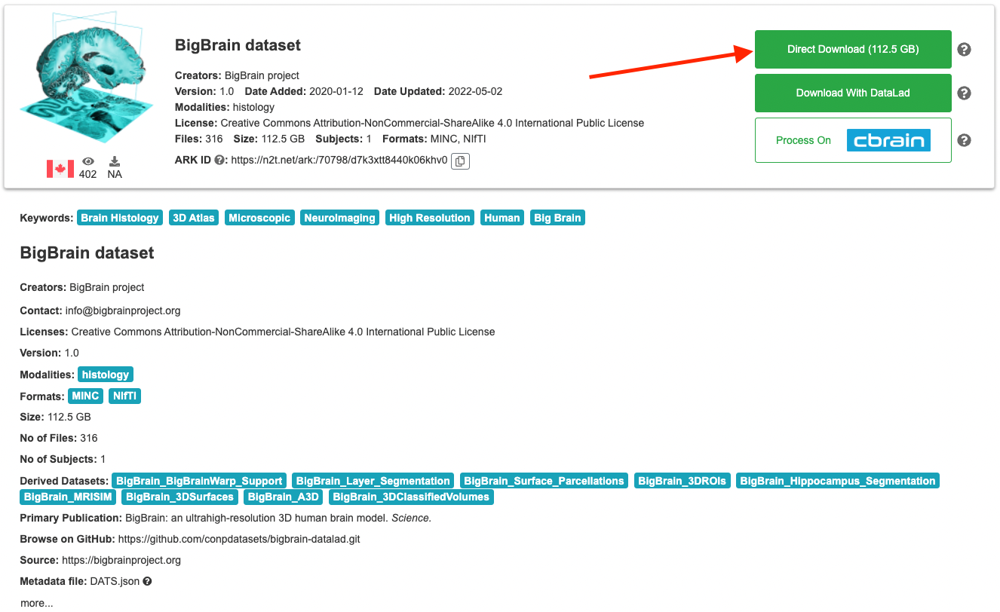
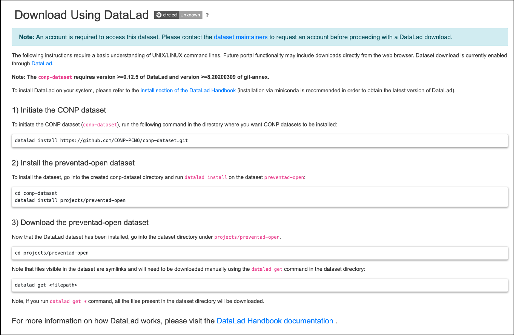
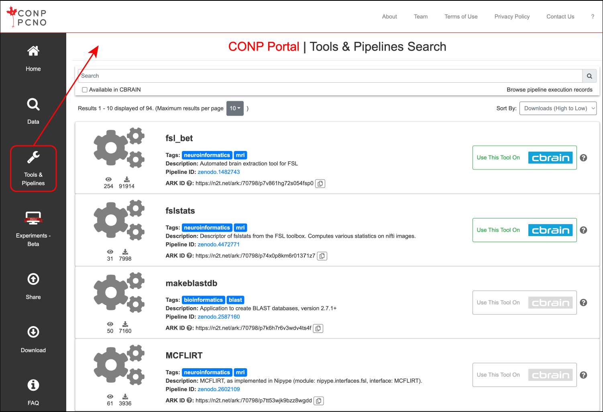
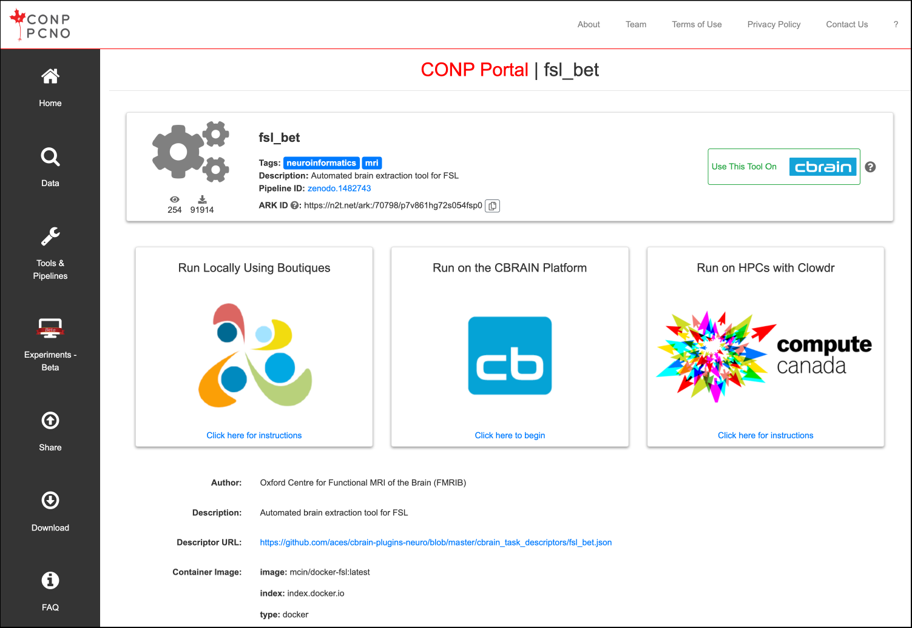
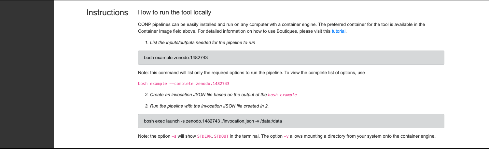
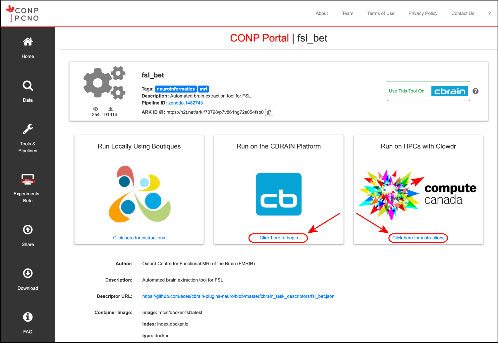

The portal is a web interface for the [Canadian Open Neuroscience Platform (CONP)](https://conp.ca) to facilitate open science in the neuroscience community. CONP simplifies global researcher access and sharing of datasets and tools.

## How can I access the portal?

The CONP portal is accessible via the Portal link of the [CONP main website](https://conp.ca) or directly at [portal.conp.ca](https://portal.conp.ca).

No login is required to access the portal but you will be asked to agree to the "Terms of Use" of the portal on your first visit. These can always be re-consulted anytime by clicking on the "Terms of Use" link at the top right of the portal web page.

Upon agreement to the "Terms of Use", you will be able to filter through the various datasets or pipelines available on the portal. 

## How can I find and download datasets?

#### How to find datasets of interest?

Datasets are listed in the [Data search page](https://portal.conp.ca/search) of the portal. This search page lists all datasets available through the CONP with some basic information about the dataset. Results can be filtered or sorted easily. 

Clicking on a dataset row in the [Data search page](https://portal.conp.ca/search) will bring the user to a more detailed dataset page that includes more description information pertinent to the dataset (including the display of the README.md file provided with the dataset) and download capabilities.

Notes:
- some datasets can be processed on the CBRAIN plateform. 
- some datasets may require a third-party account. Instructions on how to obtain an account for those datasets will be displayed on the dataset page if that is a requirement. 

Below are two dataset examples:
- one that requires a third-party account (PREVENT-AD open data) 
- one that does not require any external account and that is available for processing on CBRAIN (BigBrain dataset).

#### How to download the data?

Small datasets (<15GB) that do not require a third-party account can be downloaded directly through the frontend via the Download button located in thed detailed dataset page.

Large datasets (>15GB) or datasets that require a third-party account cannot be downloaded through the frontend of the Portal but we provide detailed instructions on how to download the dataset via [DataLad](http://www.datalad.org). Each dataset page contains a detailed ‘Dataset Download Instructions’ section that lay out the different steps to perform in order to download the dataset. 

## How can I find and run tools/pipelines?

#### How to find a tool/pipeline?

The [Tools & Pipelines page](https://portal.conp.ca/pipelines) lists all softwares registered in the portal. Each tool or pipeline present in that list page contains basic information about the tool/pipeline and its pipeline ID. 

Clicking on a specific choice will bring the user to a more detailed page with links to instructions on how to run the tool locally, to HCPs or to external platforms.

#### How to run the tool/pipeline?

###### Run the tool locally

Tools and pipelines can be run locally on any system using [Boutiques](https://boutiques.github.io) and a container engine ([Docker](http://www.docker.com) or [Singularity](https://sylabs.io/docs)) based on the Zenodo ID of the tool. The container image for the tool is listed in the detailed page of the tool/pipeline. 

At the bottom of the pipeline page, detailed instructions on how to run the tool locally are available to the user. 

If you have never used [Boutiques](https://boutiques.github.io) in the past, we recommend the following [tutorial](https://nbviewer.jupyter.org/github/boutiques/tutorial/blob/master/notebooks/boutiques-tutorial.ipynb#reusing_tools).

###### Run the tool on HPCs

Some tools and pipelines can also be run on HPCs via the CBRAIN infrastructure or in your Compute Canada account with Clowdr. 

The 'Click here to begin' link under the 'Run on the CBRAIN Plateform' container will open a tab to the login page of CBRAIN or to the tool page on CBRAIN if you are already logged in. 

The 'Click here for instructions' link under the 'Run on HPCs with Clowdr' will open a new tab with the instructions to follow to deploy a tool/pipeline on your Compute Canada account. 

## How can I upload my dataset?

Detailed instructions are available for different upload mechanisms on the [Share page](https://portal.conp.ca/share) of the portal.

## How can I upload my tool/pipeline?

You can publish your tools/pipelines using [Boutiques](https://boutiques.github.io)’ command `bosh publish`. 

For more information on how to do that, please visit the ‘Publishing your own tool’ section of the [Boutiques tutorial Python notebook](https://github.com/boutiques/tutorial/blob/master/notebooks/boutiques-tutorial.ipynb). 