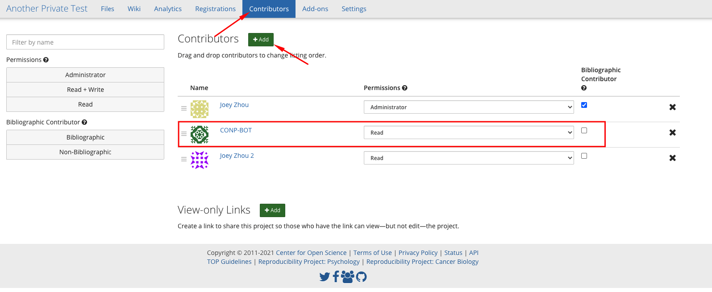

# Dataset Addition Procedures

First of all, thank you for sharing your data with CONP and the scientific community!

All datasets to upload to the CONP portal must include the following files in the root directory:

- a required `README.md` file. The content of this file will be displayed in the portal page describing your dataset.
- a required `DATS.json` file as described in [the main documentation page](https://github.com/CONP-PCNO/conp-documentation/blob/master/CONP_DATS_fields.md). We provide a [DATS GUI editor]() ***(#TODO: ADD LINK TO EDITOR)*** for easy creation of this file. Note: the content of this file will also be displayed on the portal page describing your dataset.
- optionally, a study/institutional logo to be displayed with your dataset on the portal.

It is possible to upload a dataset using one of the following options:

- [I. Upload using Zenodo](#zenodo)
- [II. Upload using OSF](#osf)
- [III. Upload on the CONP FTP server](#conp-server)
- [IV. Upload using DataLad](#datalad)

If you need help at any stage, please [open an issue in
the CONP-PCNO/conp-dataset repository](https://github.com/CONP-PCNO/conp-dataset/issues/new/choose) and we will do our best to help you.

## <a name="zenodo"></a> I. Upload using Zenodo

1. Prepare your dataset for upload. **Please note the following requirements:**

	- All datasets must include a `README.md` file in the root directory. That file will be displayed on the CONP portal page that will describe the dataset.
	- All datasets must include a `DATS.json` file as described in [the main documentation page](https://github.com/CONP-PCNO/conp-documentation/blob/master/CONP_DATS_fields.md). The content of this file will also be displayed on the CONP portal page that will describe the dataset. We provide a [DATS GUI editor]() ***(#TODO: ADD LINK TO EDITOR)*** for easy creation of this file. 
	- A logo can be added at the root of the dataset. This is optional, however, if there is a logo at the root of the dataset, it will be used on the CONP portal page that will describe the dataset.

2. Upload your dataset to [https://zenodo.org](https://zenodo.org) with the specific keyword `canadian-open-neuroscience-platform`.  If your dataset is larger than 50GB you will need to contact [Zenodo](https://zenodo.org/support) with a request category of `File upload quota increase` in order to be able to upload it.
    
3. If you set your dataset as **restricted**, create a personal token via *Applications > Personal access tokens > New Token > Check all scopes > Create* and send the token via email to CONP Technical Steering Committee member Tristan Glatard (tglatard@encs.concordia.ca).


## <a name="osf"></a> II. Upload using OSF

1. Prepare your dataset for upload. **Please note the following requirements:**

  - All datasets must include a `README.md` file in the root directory. That file will be displayed on the CONP portal page that will describe the dataset.
  - All datasets must include a `DATS.json` file as described in [the main documentation page](https://github.com/CONP-PCNO/conp-documentation/blob/master/CONP_DATS_fields.md). The content of this file will also be displayed on the CONP portal page that will describe the dataset. We provide a [DATS GUI editor]() ***(#TODO: ADD LINK TO EDITOR)*** for easy creation of this file. 
  - A logo can be added at the root of the dataset. This is optional, however, if there is a logo at the root of the dataset, it will be used on the CONP portal page that will describe the dataset.

2. Upload your dataset to [https://osf.io/](https://osf.io/) with the specific tag `canadian-open-neuroscience-platform`.
    
3. CONP supports both `private` and `public` OSF datasets. 
  - For `Public` datasets, ensure that the dataset is set to `Public` on OSF. 
  - For `Private` datasets, ensure that the dataset is set to `Private` on OSF and go to the `Contributors` tab of the dataset. In the `Contributors` tab, grant the user `CONP-BOT` the `READ` permission and do not add it as a Bibliographic Contributor. This will ensure that the CONP automatic crawler can grep the OSF dataset and add it to the CONP super dataset (https://github.com/CONP-PCNO/conp-dataset).




## <a name="conp-server"></a> III. Upload on the CONP FTP server

To upload a new dataset to the CONP server, please use the [portal 'contact us' form](https://portal.conp.ca/contact_us) so we can help you upload your data onto the CONP FTP server. 

## <a name="datalad"></a> IV. Upload using DataLad

This upload procedure requires some technical knowledge (GitHub, git, git-annex) and an account on [GitHub](http://github.com/).

The CONP datasets are managed using [DataLad](https://www.datalad.org/), a software tool for managing digital objects such as datasets, built on git and git-annex. 

**Important notes:**

- Download of the CONP data currently requires git-annex version>=8.20200309, and we recommend DataLad version>=0.12.5
- We recommend setting your `git` configuration to store your username and email:

	```
	git config --global user.name "your_user_name" 
	git config --global user.email "your.name@your.institution.ca"
	git config credential.helper cache  (keeps login information in memory for 5 mins)
	```

**Summary of DataLad upload process:**

- [1) Installing DataLad](#datalad_install)
- [2) Creating a new DataLad dataset](#dataset_creation)
- [3) Populating the new dataset](#dataset_population)
- [4) Publishing the new dataset to GitHub](#dataset_publication)
- [5) Testing the new dataset before adding it to the conp-dataset DataLad super dataset](#dataset_test)
- [6) Obtaining a Digital Object Identifier (DOI) for your dataset](#doi_obtention)
- [7) Adding the new dataset to the list of CONP datasets](#addition_to_conp-dataset) (a.k.a. https://github.com/CONP-PCNO/conp-dataset)

#### <a name="datalad_install"></a> 1) Installing DataLad

- **_on Linux_**

We recommend the Miniconda installation procedure detailed in the [Install DataLad on linux-machines with no root access](http://handbook.datalad.org/en/latest/intro/installation.html#linux-machines-with-no-root-access-e-g-hpc-systems) entry on the [DataLad Handbook](http://handbook.datalad.org/en/latest/index.html), which installs the most up-to-date versions of DataLad, git-annex, and git if needed.

- **_on Mac OS X_**

Please visit the Install DataLad section of the [DataLad Handbook](http://handbook.datalad.org/en/latest/index.html) and follow the instruction for [Mac OS X install](http://handbook.datalad.org/en/latest/intro/installation.html#macos-osx).


#### <a name="dataset_creation"></a> 2) Creating a new DataLad dataset

The first step in uploading a dataset to CONP via DataLad requires the creation of a new DataLad dataset that will be tracked on GitHub.

- Create a local DataLad directory:

  ```
  datalad create <new_dataset_name>
  ```

- Create a sibling for your dataset on GitHub. The command below will generate a sibling in your local space:

  ```
  cd <new_dataset_name>
  datalad create-sibling-github <new_dataset_name>
  ```
  To inspect existing siblings, run `datalad siblings`
	
#### <a name="dataset_population"></a> 3) Populating the new dataset

Choice of how to populate a new dataset will vary based on the special remote providing access to the data. The following procedure covers working with the [web](https://git-annex.branchable.com/tips/using_the_web_as_a_special_remote/) special remote. 

**Dataset requirements:**

- All datasets must include a `README.md` file in the root directory. That file will be displayed on the CONP portal page that will describe the dataset.
- All datasets must include a `DATS.json` file as described in [the main documentation page](https://github.com/CONP-PCNO/conp-documentation/blob/master/CONP_DATS_fields.md). The content of this file will also be displayed on the CONP portal page that will describe the dataset. We provide a [DATS GUI editor]() ***(#TODO: ADD LINK TO EDITOR)*** for easy creation of this file. 
- A logo can be added at the root of the dataset. This is optional, however, if there is a logo at the root of the dataset, it will be used on the CONP portal page that will describe the dataset.


**How to track the different files of the dataset:**

All files in the dataset must be added to the repository using one of the two commands below. Copying content from another location into your local copy of the repository without using those commands **will not work**.

- For data files on FTP or HTTP servers, use the `web` remote to populate the data:

	```
	git annex addurl <URL_of_resource> --file <linkname>
	```
	*The `--file` switch is optional but recommended, because without it the default name for a link is built from the full URL of the resource and tends to be unwieldy and/or uninformative.
	
	*NB: Generating the link requires enough space on your local machine to store the large data file, as `git-annex` needs to download the file to generate checksums.

- For metadata files (*e.g.* `README.md`, `DATS.json`, logo files), use `git` so that they are not annexed, and therefore readable by the CONP portal and users: 
  
  ```
  git add README.md
  git add DATS.json
  git add <study_logo>
  ```	
  
To save the changes made to the directory with DataLad, run:

```
datalad save -m "<a constructive message describing the state of the dataset>"
```
*Message example: `initial population of <name_of_new_dataset>`


#### <a name="dataset_publication"></a> 4) Publishing the new dataset to GitHub

Ensure that all changes have been saved in DataLad (`datalad save -m "<message>"`). Then, from the DataLad directory, publish the DataLad dataset to GitHub:

 ```
 datalad publish --to github
 ```
  
#### <a name="dataset_test"></a> 5) Testing the new dataset before adding it to the [CONP-PCNO/conp-dataset](https://github.com/CONP-PCNO/conp-dataset) DataLad super dataset

Test that the dataset published on the new GitHub repository can be correctly downloaded:

- Do a clean install of the new dataset GitHub repository on a different directory:

  ```
  datalad install -r http://github.com/<your_user_name>/<new_dataset_name>
  cd <new_dataset_name>
  ```
  *This `-r` is a recursive install, so all subdirectories and small files should be present, and links to annexed files if there are sub-modules in the new dataset.

- Test that **all** dataset files download correctly from the URLs:

  ```
  datalad get *
  ```

#### <a name="doi_obtention"></a> 6) Obtaining a Digital Object Identifier (DOI) for your dataset

Datasets in CONP are required to have a Digital Object Identifier (DOI). A DOI is a unique and permanent identifier associated with a research object to make it citeable and retrievable. To get a DOI for your dataset, follow the following steps:

- Log in to [Zenodo](https://zenodo.org), preferably using your GitHub account.

- Select the new dataset GitHub repository in the [list of GitHub repositories](https://zenodo.org/account/settings/github) in Zenodo.

- Release the new dataset on GitHub (see instructions [here](https://help.github.com/en/articles/creating-releases)). A DOI will automatically be created and it will create an archive of the new dataset on Zenodo. 

- Get the Concept DOI badge from the Zenodo list of GitHub repositories [here](https://zenodo.org/account/settings/github/). Add that DOI to the `README.md` file of your dataset and add its value to the *identifier* field of your `DATS.json` file. This DOI will always link to the DOI of the latest release of the dataset. 

#### <a name="addition_to_conp-dataset"></a> 7) Adding the new dataset to the list of CONP datasets

To add the newly created dataset to the list of CONP datasets present in the DataLad conp-dataset super dataset, you will need to submit a pull request to `https://github.com/CONP-PCNO/conp-dataset`. Circle CI will automatically test the newly added dataset to confirm whether files download correctly, validate the format of the `DATS.json` file etc...

**Procedure to follow to add the new dataset to `https://github.com/CONP-PCNO/conp-dataset`:**

- On GitHub, fork a new copy of `https://github.com/CONP-PCNO/conp-dataset` into your userspace.

- Install that copy locally:

	```
	datalad install https://github.com/<your_user_name>/conp-dataset.git
	```

- Install the new dataset into the `projects` directory

	```
	cd conp-dataset/projects
	git submodule add <new_dataset_github_repository>
	```
	*`<new_dataset_github_repository>` will be of the form `https://github.com/<username>/<new_dataset_name>.git`
	
- Save the changes and push the branch to your fork

	```
	datalad save -m '<message>'
	datalad publish --to origin
	```

- Send a pull request (PR) from your fork's `master` branch to the `master` branch of `https://github.com/CONP-PCNO/conp-dataset`. You should see 2 file changes in the PR:
  - Modification to the `.gitmodules` file to add the information for the new dataset. The added information should be of the form:

  		```
		[submodule "projects/<new_dataset_name>"]
			path = projects/<new_dataset_name>
			url = https://github.com/<username>/<new_dataset_name>.git
  		```
   		*note: ensure that there is an empty line at the end of the `.gitmodules` file otherwise it will not pass the format-checking tests of your PR.
   
  - a link to the latest commit of the <new_dataset_name> GitHub repository
